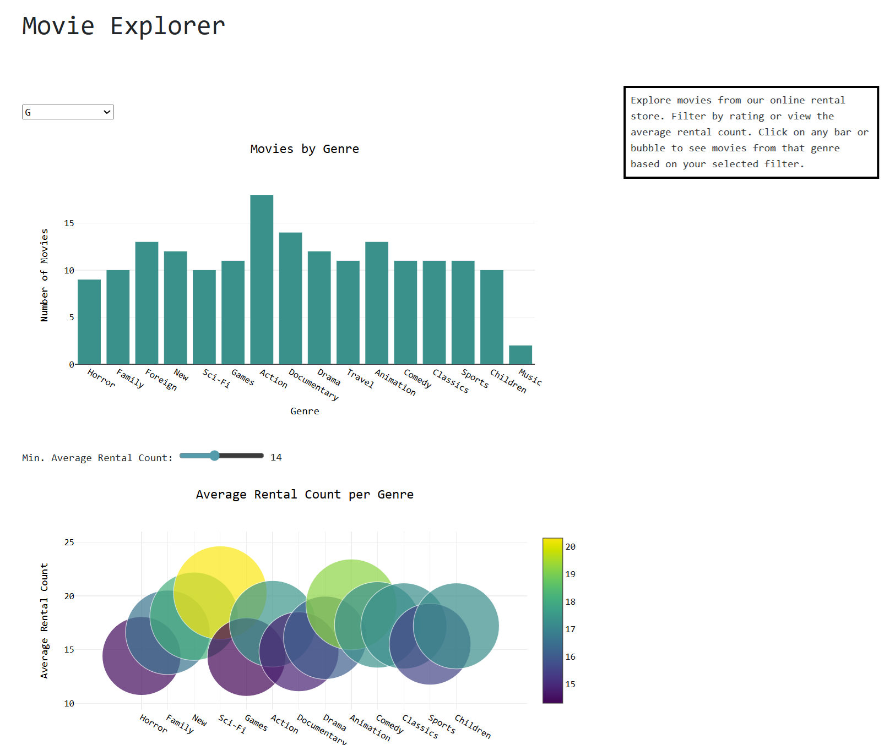

# Movie Explorer

## Project Description

This application is designed to assist customers of a fictional online movie rental store in choosing movies to watch. It provides an interactive visualization that allows users to filter movies by rating and explore genre popularity based on average rental counts. Users can click on bars and bubbles within the visualization to view specific movies within a selected rating and genre.  

I chose to use my graphql as a backend and it was using the sakila testdata so I continued to use that data set.

## Core Technologies

- Node  
- Express  
- Apollo  
- Javascript  
- MySQL  
- Azure  
- Plotly  
- Bootstrap  
- Csclod server  

Because I chose to use my graphql-API I already had a start with Node, Express, Apollo, Javascript, MySQL and Azure. I looked through the different options on how to visualize data and decided to use Plotly becasue it worked well with javascript. I deployed it on the server I recieved from the school because I´ve been using it for a while now and really started to understand how it works.

## How to Use

This is a single-page application that allows users to filter movies by rating in a dropdown meny or explore average rental counts using a slider. By clicking on any bar or bubble, users can view a list of movies within that genre, based on their selected filters.

## Link to the Deployed Application